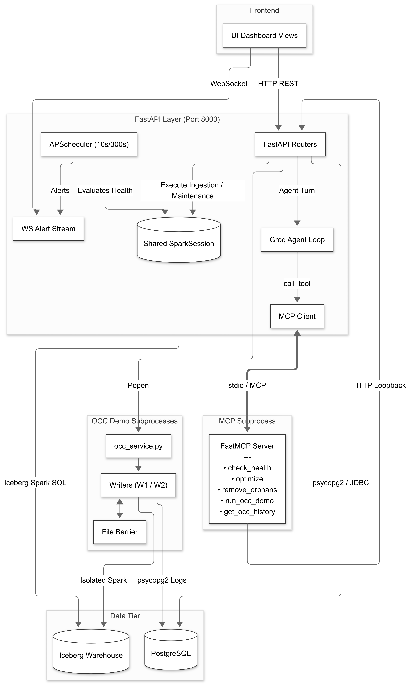

# Self-Healing ETL Pipeline with a Maintenance Copilot

Internal lakehouse maintenance tool for keeping Iceberg tables readable, compact, and explainable.

## Project Overview

This project simulates a small data platform that ingests operational order and inventory data into Postgres, loads it into Apache Iceberg through Spark, and exposes a FastAPI backend plus React dashboard for daily maintenance work.

The business scenario is a data engineering team that needs to keep a retail-style lakehouse healthy without hand-running Spark jobs all day. The copilot helps them answer questions like:

- Is a table fragmented enough to compact?
- Did the last load create delete-file bloat or orphan files?
- What changed after maintenance?
- Why did an OCC write fail?

## Architecture



**Fig 1**: System Architectural Diagram

### Layer 0: Initial Data Generation

Before any loader runs, the `raw` schema needs historical data to load. `data/faker_generator.py` populates it in a fixed sequence: customers -> products -> `dim_date` -> orders -> order items, since orders and items have foreign-key dependencies on the tables generated before them.

- **Volume**: 500 customers, 100 products, a full `dim_date` range (`2023-01-01` to `2024-12-31`), 10,000 orders with 1-4 line items each.
- **Order status is date-aware, not random**: orders older than 21 days before the dataset's end date (`DATE_END`) are treated as resolved - 90% delivered, 10% returned, with `updated_at` set to a realistic shipping delay (2-10 days, plus extra days for returns) after `created_at`. Orders within the last 21 days are left "in motion" (pending/confirmed/shipped, `updated_at == created_at`), so the dataset ends with a believable mix of closed and active orders rather than everything resolved or everything pending.
- **Idempotency**: every insert uses `ON CONFLICT DO NOTHING`, so re-running the generator against a partially-populated schema doesn't fail or duplicate rows.

This step runs once, before `etl/init_schema.py` (creates the schema) and `etl/initial_load.py` (loads Postgres -> Iceberg). See Setup & Run Instructions for the exact order.

### Layer 1: Postgres (`raw` schema, OLTP)

Source of truth for all operational data. Three loader scripts move data out of it into Iceberg, each with a distinct responsibility:

- **`initial_load.py`** - one-time bulk load. Reads all five source tables over JDBC, assigns surrogate keys to dimension tables only (`monotonically_increasing_id()`), and writes every Iceberg table with `createOrReplace()`. Safe to run exactly once against a clean warehouse; also resets the watermark row so the first incremental run starts clean.
- **`incremental_load.py`** - watermark-driven CDC. Reads only rows changed since the last successful run (`updated_at > last_loaded_at`, pushed down to Postgres via the JDBC subquery), then `MERGE`s into the Iceberg fact tables. Exposes `run_incremental_load(spark)` as a reusable function so both the CLI entry point and `simulate_batches.py` share the exact same merge logic.
- **`inventory_load.py`** - one-time snapshot load of `fact_inventory`, isolated from the orders/items pipeline since it exists purely to give the OCC demo a dedicated, mutable table to contend over.

### Layer 2: Apache Iceberg (`warehouse` namespace, Hadoop catalog)

- `dim_customer`, `dim_product`, `dim_date` - dimensions with surrogate keys, written once by `initial_load.py`.
- `fact_orders`, `fact_order_items`, `fact_inventory` - fact tables, all configured Merge-on-Read (`write.merge.mode`, `write.update.mode`, `write.delete.mode = merge-on-read`) with metadata cleanup enabled (`delete-after-commit`, `previous-versions-max = 10`) so metadata.json accumulation doesn't run away by default.

### Layer 3: FastAPI backend (`backend/`)

- A single shared `SparkSession` is created once at process startup (`dependencies.py` lifespan) and reused across every request, guarded by an `asyncio.Lock` (`spark_busy_lock`) so overlapping requests (e.g. a simulation run and a scheduled health check) can't issue concurrent queries against it and produce transient false-healthy readings.
- Routers are split by concern: `health`, `maintenance`, `orphans`, `simulation`, `chat`, `occ`, `notifications`. Each maps to one or more MCP tools.
- An `APScheduler` background job (`check_table_health_job`, every 300s) is the sole periodic writer of health history rows and the trigger for proactive agent alerts pushed over WebSocket.

### Layer 4: MCP + agent

- `agent_tools.py` runs as a **separate subprocess**, communicating with the FastAPI process over stdio via the MCP protocol (`ClientSession`), not as an imported Python module. Each tool then makes an HTTP call back to the same FastAPI instance it's a subprocess of (loopback pattern).
- This is deliberate: it gives the agent and a human user the exact same interface (both go through the HTTP API), decouples the tool process's lifecycle from the Spark/JVM lifecycle, and allows tools to be tested in isolation with MCP Inspector without needing a live agent loop.
- `agent.py` builds the tool-calling loop against Groq (`llama-3.3-70b-versatile`), forcing `tool_choice="required"` when an action verb is detected in the user's message, and validating every `table_name` argument against a `KNOWN_TABLES` allowlist before it reaches a tool call. Destructive tools (`optimize_lakehouse_table`, `remove_orphan_lakehouse_files`) always default to `confirmed=False`; the agent cannot self-authorize based on user phrasing alone.

### Layer 5: React frontend

Five views (Dashboard, Storage Analytics, Simulation, OCC Demo, Dedicated Work Chat), backed by domain-specific data hooks and a WebSocket connection for proactive alerts, all talking to the FastAPI layer above.

## How Initial Data Is Generated

Before any loader runs, the `raw` schema needs historical data to load. `data/faker_generator.py` populates it in a fixed sequence: customers -> products -> `dim_date` -> orders -> order items, since orders and items have foreign-key dependencies on the tables generated before them.

- **Volume**: 500 customers, 100 products, a full `dim_date` range (`2023-01-01` to `2024-12-31`), 10,000 orders with 1-4 line items each.
- **Order status is date-aware, not random**: orders older than 21 days before the dataset's end date (`DATE_END`) are treated as resolved - 90% delivered, 10% returned, with `updated_at` set to a realistic shipping delay (2-10 days, plus extra days for returns) after `created_at`. Orders within the last 21 days are left "in motion" (pending/confirmed/shipped, `updated_at == created_at`), so the dataset ends with a believable mix of closed and active orders rather than everything resolved or everything pending.
- **Idempotency**: every insert uses `ON CONFLICT DO NOTHING`, so re-running the generator against a partially-populated schema doesn't fail or duplicate rows.

This step runs once, before `etl/init_schema.py` (creates the schema) and `etl/initial_load.py` (loads Postgres -> Iceberg). See Setup & Run Instructions for the exact order.

## How data changes over time

The system models two different kinds of change, and the pipeline treats them differently:

- **Order lifecycle changes** - existing orders move forward through a fixed status chain (`pending -> confirmed -> shipped -> delivered -> returned`), never backward. `incremental_fixture.py` enforces this via a lookup table (`STATUS_PROGRESSION`) rather than conditional branches, and a `delivered` order only has an 8% chance of flipping to `returned`, and only within a `RETURN_WINDOW_DAYS` cutoff - once that window closes, the order is excluded from further changes entirely. This produces a realistic mix of resolved and in-flight orders rather than every order eventually resolving.
- **New activity** - each simulated batch also inserts a handful of brand-new orders (with fresh line items) and, 10% of the time, a brand-new customer. Both changes are timestamped at `batch_date`, which itself advances irregularly: 80% of batches jump forward by hours (a day passing), 20% stay within the same day (multiple loads landing on one calendar day) - this variability is what actually exercises the watermark logic under realistic, non-uniform timing instead of a clean daily cadence.
- **Propagation to the lakehouse** - `incremental_load.py` picks up everything changed since the last watermark and applies it with different `MERGE` semantics per table: `fact_orders` gets both `WHEN MATCHED THEN UPDATE` (status/timestamp changes) and `WHEN NOT MATCHED THEN INSERT` (new orders), while `fact_order_items` only ever inserts, since line items are immutable once created. The watermark itself is derived from `MAX(updated_at)` on the merged data - not wall-clock time - because simulated batches backdate their timestamps, and using `datetime.now()` would race ahead of the simulated timeline and silently drop everything in between on the next run.
- **Effect on table health** - these two different mutation patterns produce two different degradation signatures: `fact_orders`' repeated in-place updates behave like Copy-on-Write write amplification, while `fact_order_items`' pure-insert pattern produces genuine small-file fragmentation. The health/maintenance layer diagnoses and treats these differently rather than applying one blanket fix.
- **Concurrent writes** - `fact_inventory` is the one table where two writers can attempt to change the *same* row at the *same* time. The OCC demo forces this by having two independent Spark processes read the same snapshot (synchronized via a file-based barrier so neither writer gets a head start), then both attempt a `MERGE` that decrements `quantity`. Iceberg's optimistic concurrency control lets exactly one commit succeed and rejects the other, which is logged to `occ_conflict_log` from inside the writer process itself.

## How health data is captured

Not every read of a table's health produces a logged row - logging is opt-in (`record_history: bool = False`), because unconditional logging on every call previously saturated the trend chart with polling noise:

- **Logged automatically**: the scheduled background check (`check_table_health_job`, every 300s), every post-merge check inside `initial_load.py` / `incremental_load.py`, and every before/after snapshot taken during `run_maintenance()` or orphan removal.
- **Not logged**: ad hoc reads, such as a user opening the dashboard or the agent calling `check_lakehouse_health` mid-conversation - these query live metrics without writing to `table_health_history`.
- **Fragmentation verdicts** (`HEALTHY` / `FRAGMENTED` / `UNKNOWN`) use one shared threshold check (`_is_fragmented`) reused identically by the standalone script and the API - a table is never called fragmented on partially-failed metrics; `_collection_failed` must be checked first, or the result is `UNKNOWN`.

## Tech Stack

Backend and data:

- Python 3.13
- FastAPI
- Uvicorn
- APScheduler
- Apache Spark 4.1.x
- Apache Iceberg 1.11.0
- PostgreSQL via `psycopg2`
- MCP server/client tooling
- OpenAI SDK pointed at Groq for the agent runtime
- Pandas, Pydantic, Faker, HTTPX, python-dotenv

Frontend:

- React 19
- Vite
- TypeScript
- Tailwind CSS
- TanStack Query
- Jotai
- Axios
- Recharts
- Lucide React

## Data Model

This project has two distinct data layers: an **operational source layer** in Postgres (`raw` schema) and an **analytical lakehouse layer** in Apache Iceberg. The ETL pipeline moves data from the former into the latter.

### Dimensions

| Table | Primary Key | Description | Main Attributes |
|------|-------------|-------------|-----------------|
| `customers` | `customer_id` | Customer master data | name, email, address, city, tier, phone |
| `products` | `sku_code` | Product master data | name, category, sub_category, selling_price, is_active |
| `dim_date` | `date_id` | Calendar dimension | full_date, year, month, month_name, day, day_name, week, quarter, is_weekend |

### Facts

| Table | Primary Key | Description | Main Attributes |
|------|-------------|-------------|-----------------|
| `orders` | `order_id` | Order header (mutable) | customer_id, sku_code, date_id, quantity, total_amount, status, created_at, updated_at |
| `order_items` | `item_id` | Order line items (immutable) | order_id, sku_code, quantity, unit_price, discount, line_total, created_at |
| `fact_inventory` | `inventory_id` | Warehouse inventory used for the OCC demo | sku_code, warehouse_id, quantity, updated_at |

### Pipeline / Operational Support Tables

| Table | Primary Key | Description |
|------|-------------|-------------|
| `pipeline_watermark` | `source_name` | Stores incremental load checkpoints (`last_loaded_at`, `updated_at`) |
| `table_health_history` | - | Stores health snapshots captured by the maintenance loop, including storage metrics, metadata metrics, orphan file counts, and maintenance event types |
| `occ_conflict_log` | - | Stores the outcome of each writer in the OCC concurrency demo, including error type and error message |

### Relationships

| Parent Table | Child Table | Relationship |
|--------------|-------------|--------------|
| `customers.customer_id` | `orders.customer_id` | One customer can place many orders |
| `products.sku_code` | `orders.sku_code` | One product can appear in many orders |
| `dim_date.date_id` | `orders.date_id` | One date can have many orders |
| `orders.order_id` | `order_items.order_id` | One order contains many order items |
| `products.sku_code` | `order_items.sku_code` | One product can appear in many order items |

### Apache Iceberg Lakehouse Tables
*(Catalog: `local`, Namespace: `warehouse`)*

| Table | Source | Notes |
|------|--------|-------|
| `dim_customer` | `raw.customers` | Adds surrogate key `customer_sk` using `monotonically_increasing_id()` and is written once with `createOrReplace()` |
| `dim_product` | `raw.products` | Adds surrogate key `product_sk` |
| `dim_date` | `raw.dim_date` | Adds surrogate key `date_sk` |
| `fact_orders` | `raw.orders` | Merge-on-Read table with metadata cleanup enabled. Month partitioning by `created_at` exists in code but is currently commented out, making the table unpartitioned. |
| `fact_order_items` | `raw.order_items` | Merge-on-Read table with metadata cleanup enabled. No partitioning defined. |

> **Surrogate Keys**
>
> Surrogate keys are assigned only to dimension tables and are generated once during `initial_load.py`. This is safe because the script is executed exactly once against a clean warehouse. Fact tables retain their natural keys from the Postgres source.
### Iceberg Metadata Reference

Apache Iceberg tracks table state through a layered metadata structure, separate from the actual data. Understanding this layering is necessary to read the health metrics and before/after maintenance numbers used throughout this project.

- **Data files** — the actual Parquet files holding table rows. `live_file_count` counts data files referenced by the current snapshot; `physical_file_count` counts every Parquet file physically present on disk (data + delete files combined), regardless of whether anything still references it. A gap between the two is a signal of leftover, unreferenced files.

- **Delete files** — under Merge-on-Read (the mode used by every fact table in this project), an `UPDATE`, `MERGE`, or `DELETE` doesn't rewrite the affected data file. Instead it writes a small delete file that marks which rows in an existing data file are no longer valid. Position delete files (the kind used here) mark deletions by file + row position. These are invisible to `rewrite_data_files` — they only get cleaned up by `rewrite_position_delete_files` (`compact_delete_files()` in this project), which is why `delete_file_count` can climb independently of `live_file_count`.

- **Manifests** — a manifest is a file listing a set of data files (or delete files) and their statistics (row counts, column bounds, etc.). Manifests are what a query engine actually reads to prune irrelevant files before scanning. `manifest_count` in this project queries `{table}.manifests`, which reflects the manifests belonging to the **current snapshot only**, not an accumulated history.

- **Manifest list** — one per snapshot. It's the file that lists *which manifests* make up that snapshot's complete view of the table. Every commit (every `MERGE`) produces a new manifest list. This project doesn't query manifest list count directly, but it's what a snapshot fundamentally *is* underneath — a pointer to one manifest list.

- **Snapshot** — a complete, versioned view of the table at one point in time, defined by its manifest list. Every successful `MERGE`/`UPDATE`/`INSERT` creates a new snapshot; the previous one isn't deleted automatically, it just stops being the "current" pointer. `snapshot_count` tracks how many are currently retained. `expire_snapshots()` is what actually prunes old ones (and, transitively, the data files that only those old snapshots referenced) — this project explicitly passes `older_than => TIMESTAMP '{now}'` rather than relying on Iceberg's ~5-day default, since the default means freshly created snapshots during a demo/test cycle would never qualify for expiry.

- **metadata.json** — the top-level file recording the table's schema, partition spec, and — critically — a pointer to the *current* snapshot's manifest list. Every commit writes a brand-new `metadata.json`; by default Iceberg keeps every one it's ever written (`write.metadata.previous-versions-max` defaults to 100, `delete-after-commit` defaults to false). This project turns both of those on at table-creation time (`initial_load.py`), so `metadata_json_count` doesn't grow unbounded by default. Unlike the other metrics, there's no "live" vs "physical" split for this one — it's pure accumulated history, counted directly off disk.

- **Orphan files** — Parquet files physically present under a table's `data/` directory that are not referenced by *any* retained snapshot's manifests — typically leftovers from a failed write or an aborted compaction, not normal churn from MERGE. Counted read-only via Iceberg's own `remove_orphan_files(..., dry_run=true)` procedure (so the count always matches exactly what an actual deletion would remove), and only physically deleted through a separate, explicitly confirmed action — never automatically as part of routine maintenance. Iceberg enforces a hard 24-hour minimum on `older_than` for this operation, to avoid deleting files a concurrent job might still be mid-write on.

**How a `MERGE` under Merge-on-Read touches each layer:** a new metadata.json is written -> pointing to a new manifest list -> covering a new snapshot -> whose manifests reference the original data files (untouched) plus one new delete file marking which rows are now stale. This is why `live_file_count` alone doesn't tell the whole story: a table can look file-light while quietly accumulating delete files, manifests, snapshots, and metadata.json versions underneath — which is exactly why this project tracks all of these independently rather than collapsing them into a single "health" number.

## Setup And Run

These steps are intended to work from a clean clone. Do know that it requires spark version 4.1.x.

### Prerequisites

- Python 3.13
- Node.js 20+ for the frontend
- A running PostgreSQL instance with the `raw` schema available
- Java installed for Spark
- A Groq API key for the agent runtime
- A shell environment that can run Spark with the warehouse path used by the repo

Important: the current Spark warehouse path is configured as `/tmp/warehouse` in `config/config.py`. On native Windows, run the project in WSL2/Linux or adjust that path before starting Spark.

### 1. Configure environment variables

Create a `.env` file at the repository root with the same keys shown in `.env.example`:

```env
DB_HOST=yourhostname
DB_PORT=yourport
DB_NAME=yourdatabasename
DB_USER=yourusername
DB_PASSWORD=yourpassword

GEMINI_API_KEY=yourgeminiapikey
GROQ_API_KEY=yourgroqapikey
```

### 2. Install backend dependencies

From the repository root:

```bash
uv sync
```

### 3. Start the backend

```bash
uv run uvicorn backend.main:app --reload --port 8000
```

The backend exposes routes under `/api`, including:

- `/api/health`
- `/api/health/history`
- `/api/maintenance`
- `/api/orphans`
- `/api/simulate`
- `/api/watermark`
- `/api/reset`
- `/api/chat`
- `/api/occ/run`
- `/api/occ/conflicts`
- `/api/ws/alerts`

### 4. Start the frontend

In a second terminal:

```bash
cd frontend
npm install
npm run dev
```

### 5. Seed or refresh data

The repo includes scripts under `data/` and `etl/` for building the source tables and loading Iceberg. The most important ones are:

- `etl/initial_load.py` for the initial Spark-to-Iceberg load
- `etl/incremental_load.py` for checkpointed incremental updates
- `etl/simulate_batches.py` for generating repeatable load activity

Run them only after the database and environment variables are in place.

## Key Forensic Findings

These are the kinds of concrete outputs the project uses to prove the system is doing real work.

### Snapshot and manifest evidence

From the notebook, the Iceberg snapshot summary showed the commit actually rewrote data and metadata instead of just pretending to:

```text
|committed_at           |operation|files_added|
|2026-07-01 06:35:43.634|overwrite|25         |
|2026-07-01 06:36:37.348|overwrite|1          |
|2026-07-01 06:36:41.55 |overwrite|2          |
```

The same snapshot history also exposed Iceberg’s commit-level metadata:

```text
|manifests-created -> 2|
|manifests-replaced -> 1|
|added-data-files -> 1|
|deleted-data-files -> 1|
|total-data-files -> 1|
|total-delete-files -> 0|
|format-version -> 2|
|write.merge.mode -> merge-on-read|
```

The `fact_orders.manifests` table returned a manifest count of 6 in the notebook run, which is the clearest proof that the table had accumulated multiple manifest entries over time.

### Before / after storage evidence

The warehouse scan showed a fragmented physical layout before cleanup:

```text
Scanning: D:\tmp\warehouse\warehouse\fact_orders\data
Total physical parquet files on disk: 41
Total size: 1259.6 KB
```

After a later maintenance pass, the Iceberg table state showed a single live data file and a long tail of delete files still present in the warehouse:

```text
|file_path                                                                                               |file_size_in_bytes|
|/tmp/warehouse/warehouse/fact_orders/data/00000-806-78810081-f0c9-4350-9455-1b75905b2c9e-0-00001.parquet|32828             |
```

And the delete-file listing made the Merge-on-Read behavior obvious:

```text
|/tmp/warehouse/warehouse/fact_orders/data/00000-1052-6f910fcb-4995-4d01-9019-6f6d42c08b1a-00001-deletes.parquet|1513|
|/tmp/warehouse/warehouse/fact_orders/data/00000-700-d306f726-e0d9-49a6-b18d-ad992e9382d9-00004-deletes.parquet |1508|
|/tmp/warehouse/warehouse/fact_orders/data/00000-638-...-deletes.parquet                                        |... |
```

### Table-property evidence

The table properties confirmed the Iceberg write mode in use:

```text
|key                            |value              |
|current-snapshot-id            |3191331259433771885|
|format                         |iceberg/parquet    |
|format-version                 |2                  |
|write.delete.mode              |merge-on-read      |
|write.merge.mode               |merge-on-read      |
|write.update.mode              |merge-on-read      |
```

## Demo Script

Use these prompts or actions during a demo:

1. Ask the copilot to explain why `fact_orders` is fragmented and whether maintenance is needed.
2. Run the OCC demo and ask it to explain the failed writer versus the committed writer.
3. Trigger an optimization for `fact_orders` and compare the before/after health history.
4. Ask for orphan-file risk after a failed write or interrupted compaction.
5. Switch to the chart view and inspect the maintenance trend over time.

Sample user questions:

- "What is this website about and what is the purpose of copilot here?"
- “Why did the health check mark this table as fragmented?”
- “What changed after compaction?”
- “Explain the OCC conflict in plain English.”
- “Can I trust this file-count number?”
- “What should I do if delete files keep growing?”

## Challenges Attempted And What I Learned

### Challenge: Simulate an OCC conflict and have the agent explain it in plain language

- Implemented as two independent OS subprocesses (`occ_writer.py`), each opening its own `SparkSession`, synchronized through a file-based barrier in `/tmp/occ_barrier/` so both writers read the identical Iceberg snapshot before either attempts a `MERGE` against `fact_inventory`. This guarantees a genuine commit-time race rather than a scripted, fake "conflict."
- Iceberg's own optimistic concurrency control decides the winner, not application code — exactly one writer's `MERGE` commits, the other fails on a concurrent-modification check. Each writer logs its own outcome directly to `raw.occ_conflict_log` via psycopg2, so the result is a real recorded fact, not a hypothetical.
- The non-determinism was the hardest part to trust at first: sometimes writer 1 fails, sometimes writer 2 does, depending purely on which commit reaches the catalog first. Initially this looked like a bug. Confirming it was correct behavior (and not a race in my own harness) required rerunning the demo multiple times and checking that `occ_conflict_log` always showed exactly one winner and one loser per run.
- The agent explains the conflict by reading back from `occ_conflict_log` and the tool output of `get_occ_history` — it is explicitly instructed not to invent a plausible-sounding explanation, so if the log is empty or stale, the agent's answer reflects that rather than fabricating a narrative.
- I initially assumed OCC should be demonstrated on `fact_orders` as well, since it's also Merge-on-Read. I scoped it back to `fact_inventory` only, since that's the one table built specifically to give two writers a shared row to contend over without interfering with the order lifecycle simulation.

### Challenge: Run health checks on a schedule and have the agent proactively flag problems

- `APScheduler`'s `check_table_health_job` runs every 300 seconds against `fact_orders` and `fact_order_items`, independent of any user action or dashboard being open.
- This is the one path allowed to write unconditionally to `table_health_history` — every other health read (dashboard opens, ad hoc agent questions) is intentionally *not* logged, because early on unconditional logging on every read saturated the trend chart with polling noise instead of showing meaningful history.
- When the scheduler's plain threshold check (`_is_fragmented`) flags a table, it synchronously invokes the agent to turn that raw verdict into a grounded natural-language explanation, then pushes it to the frontend over WebSocket with `requiresConfirmation`, `confirmationType`, and `targetTable` fields — so the agent explains and contextualizes an alert that already fired, it doesn't decide on its own that something is wrong.
- A real bug here taught me the most: `_safe_metric()` was silently swallowing a `CHECK` constraint mismatch (`"before_maintenance"` vs. the schema's expected `"maintenance_before"`), so maintenance runs were succeeding in Spark but producing zero rows in the history table. The failure was invisible until I compared row counts directly against expected job runs — nothing in the logs pointed at it, since the try/except around metric collection was doing exactly what it was designed to do for a different failure mode.
- I also had to add an `asyncio.Lock` around the shared Spark session once the scheduler and manual actions (like the simulation runner) could overlap. Without it, concurrent Spark queries were occasionally failing collection mid-flight, and `get_table_health()`'s null-coercion was quietly turning that into a false "healthy" reading instead of surfacing the failure.

### General lessons

- The agent must be grounded in live tool output. If a tool returns stale or incomplete data, the answer becomes stale or incomplete too, so the prompts explicitly forbid inventing metrics.
- Merge-on-Read keeps delete files around even when data files have been compacted, so a low live-file count is not the same thing as a fully cleaned table.
- The warehouse history tables are what make the demo trustworthy: `raw.table_health_history` and `raw.occ_conflict_log` let the frontend show real history instead of fabricated charts.

## Answers To The Required Reflection Questions

### 4.1 Data And Iceberg Understanding

**What specifically did the Metadata File, Manifest List, and Manifest File each contain, and how did you verify it yourself?**

- The metadata.json held table-level state: current schema, partition spec, table properties, format version, and a pointer to the current snapshot's manifest list. I verified this directly in Spark by inspecting table properties (`format-version`, `write.merge.mode`, `current-snapshot-id`) rather than trusting a description of what it "should" contain.
- The manifest list held the snapshot-level summary: which manifests make up that snapshot, plus commit counters. I verified this from actual snapshot summary output — `manifests-created`, `manifests-replaced`, `added-data-files`, `deleted-data-files` — captured in the notebook after real `MERGE` commits, not from documentation examples.
- The manifest file held the file-level entries: the specific data files and delete files a snapshot references. I verified this by querying `{table}.files` and `{table}.manifests` directly and cross-checking the counts against the physical Parquet files actually present on disk in the warehouse directory — when the live count and physical count diverged, that gap was itself evidence the layering was real, not just described correctly in the code comments.

**Where exactly did partition pruning save work, and what evidence did you actually look at?**

- In the project, paritition has not been applied. Initially, a paritition by date for `fact_order` table was added, but it was later removed. The focus of the project is more on the metadata, maintenance and removing small file problem. So adding partition itself wouldn't add any value. But in case of analytical query, it would save a lot of time during searching for the required data, which could be seen through the explain plan.

**What would go wrong if a schema change used rename instead of evolution, and how does Field ID avoid it?**

- Iceberg tracks column identity internally by field ID, not by name. If a column were renamed by dropping the old name and adding a "new" one instead of using Iceberg's schema evolution API, older snapshots and any reader expecting the original field would see it as missing or as an entirely different column — the historical data wouldn't reconcile with the new schema.
- Proper schema evolution (rename-in-place) preserves the same field ID across the change, so every snapshot — past and future — still resolves that column to the same logical field regardless of what it's currently called. That's what lets Iceberg time-travel and read old snapshots correctly even after schema changes; identity survives the rename because it was never tied to the name in the first place.

### 4.2 AI Agent And Engineering Understanding

**Which parts of the MCP tool output does the agent actually rely on, and what happens if that data is bad or stale?**

- The agent relies entirely on the JSON payload returned by each MCP tool call — health metrics, maintenance before/after snapshots, orphan counts, OCC results, OCC history — mediated through the HTTP loopback to FastAPI, not on anything it recalls from earlier in the conversation or infers on its own.
- The system prompt explicitly forbids inventing numbers. If a tool returns stale, partial, or null data (e.g. a metric that failed collection via `_safe_metric()`), the agent's answer will faithfully reflect that gap — including an `UNKNOWN` fragmentation verdict rather than guessing — since `_is_fragmented` refuses to classify on partially-failed metrics.
- Practically: the trust boundary in this system is the tool output, not the model's language. A wrong tool result produces a wrong (but at least honestly-derived) answer; the agent isn't a second, independent source of truth.

**Where did you have to override, correct, or sanity-check something the AI assistant generated?**

- The clearest example was the `_safe_metric()` swallow bug: maintenance runs were succeeding in Spark but writing zero rows to `table_health_history`, because a `CHECK` constraint mismatch (`"before_maintenance"` vs. the schema's `"maintenance_before"`) was being silently caught by the same try/except designed to let one failed metric not abort the whole report. Nothing in the surface-level logs pointed at it — I only found it by comparing expected job runs against actual row counts.
- I also had to correct an early assumption around partition pruning, where a first pass read as if `fact_orders` were partitioned when the transform was actually commented out — I only trusted that story once I'd confirmed it against the literal line in `initial_load.py`.
- After the medallion refactor (introducing genuine `bronze`/`silver`/`gold` namespaces), I had to sanity-check every module that referenced the old flat `warehouse.` prefix — some maintenance and health-metric code still had it hardcoded, producing malformed paths like `local.warehouse.bronze.orders` until corrected.

**If a stakeholder asked "can I trust this number?", what would you point to?**

- `raw.table_health_history` — the opt-in, scheduler-logged history of health snapshots, not ad hoc reads.
- `raw.occ_conflict_log` — the per-writer OCC outcomes logged directly from inside each writer process.
- Iceberg's own snapshot summaries and metadata tables (`{table}.files`, `{table}.manifests`, `{table}.snapshots`) — the ground truth the health metrics are computed from.
- The before/after maintenance rows written by `run_maintenance()`, since those pair a concrete state change to a concrete before/after health read rather than a narrative claim.

### 4.3 Business Understanding

**Who would actually use this, and what decision would they make differently?**

- Data engineers, platform engineers, and on-call analytics owners responsible for keeping a lakehouse performant without manually running Spark maintenance jobs.
- They would use it to decide whether a table actually needs compaction versus being falsely flagged, whether to trust a fragmentation alert before escalating it, whether an OCC failure represents a real concurrency problem or an expected one-writer-wins outcome, and whether orphan files are safe to delete versus still mid-write.

**What is the biggest risk if the pipeline silently broke for a week, and would the system catch it?**

- The biggest risk is serving stale order or inventory state while every downstream consumer assumes the data is current — the dashboard could look "healthy" purely because nothing is actively erroring, not because data is actually flowing.
- The scheduler and history tables would catch fragmentation or maintenance-related degradation, since those checks run independent of whether new data is arriving. But a pure source-ingestion failure — the upstream Postgres feed simply stopping — could still be missed, since the health-check path itself would remain up and reporting on whatever data already exists, without a build-in check for "no new watermark advancement" as its own kind of alert.

## Notes

- The frontend is a single-shell dashboard with view switching rather than router-based navigation.
- The OCC demo is wired for `fact_inventory`.
- The backend uses a shared Spark session and a shared MCP client session during the FastAPI lifespan.
